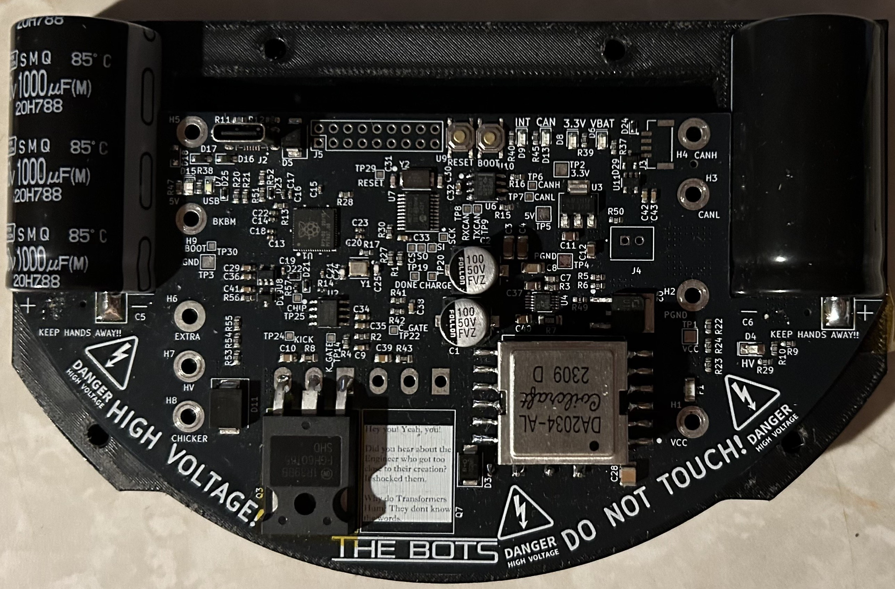
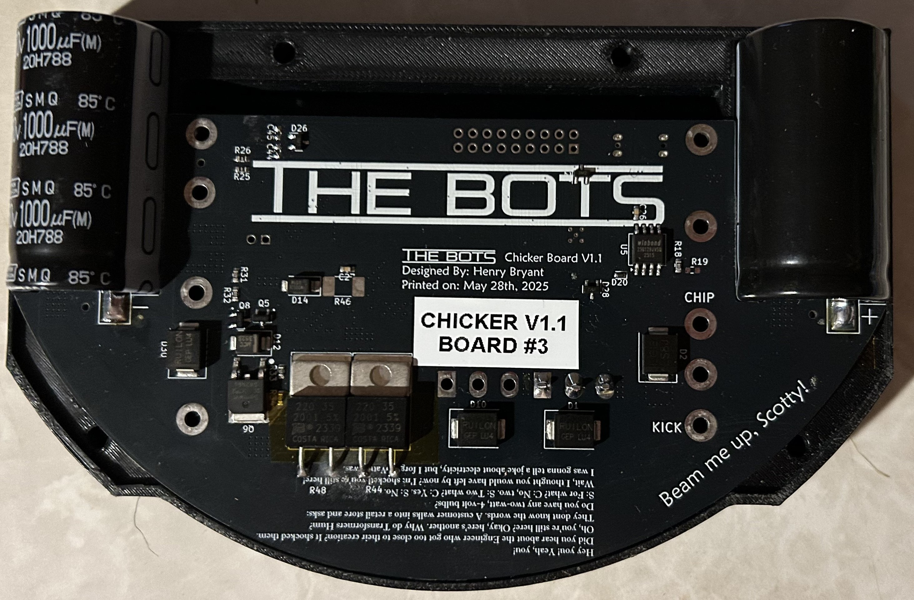

# Board Description

This is a high voltage board that uses a LT3750 Flyback Charge controller to charge two 1000micro farad capacitors to 210V (these are 250V rated)

The board was designed in KiCad and the Files are available in this Github. It uses a novel power pillar design to transmit power and signals over Brass standoffs (including HV) which go to the midplate (power distribution board and chassis). 

When the robot kicks, the chicker sends a pulse from 500 to 5000us to the IGBT gate driver, turning the solenoid on for a specified time generating more force with more applied current.

